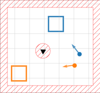
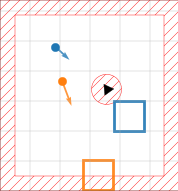
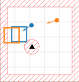
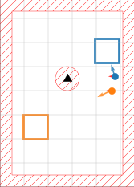
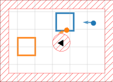
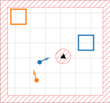

## Autoregressive Guidance of Deep Spatially Selective Filters using Bayesian Tracking for Efficient Extraction of Moving Speakers

This page act as supplementary material to our work on *Autoregressive Guidance of Deep Spatially Selective Filters using Bayesian Tracking for Efficient Extraction of Moving Speakers* [1].

### Social Force Motion Model

<table style="margin-left: auto; margin-right: auto;">
  <tr>
    <td></td>
    <td></td>
    <td></td>
  </tr>
  <tr>
    <td></td>
    <td></td>
    <td></td>
  </tr>
</table>

We present an adaption of the Social Force Model from Helbing et al. [2] to model speaker movement. Via a Neutonian formulation, we achieve smooth and environmentally aware speaker trajectories in enclosed acoustic scenarios. This repository provides the code that generates our dataset presented in [1], which uses speech mixtures based on LibriMix [3] with additonal diffuse noise according to the recipe in [4].
For spatialization, we use gpuRIR [5], a GPU-accelerated implementation of the image method. See the provided Jupyter Notebooks for example usage.

### References

[1] J. Kienegger, T. Gerkmann, "Autoregressive Guidance of Deep Spatially Selective Filters using Bayesian Tracking for Efficient Extraction of Moving Speakers", *Preprint*, 2026. [arXiv](http://arxiv.org/abs/2603.23723)

[2] D. Helbing, P. Molnár, "Social force model for pedestrian dynamics", *Phys. Rev. E*, vol 51, 1995.

[3] J. Cosentino et al. "LibriMix: An Open-Source Dataset for Generalizable Speech Separation", 2020.

[4] E. Habets, S. Gannot, "Generating sensor signals in isotropic noise fields", *JASA*, vol 122, 2007.

[5] D. Diaz-Guerra, A. Miguel, J. Beltran, "gpuRIR: A python library for room impulse response simulation with GPU acceleration", *Multimedia Tools and Applications*, vol 80, 2020.
   